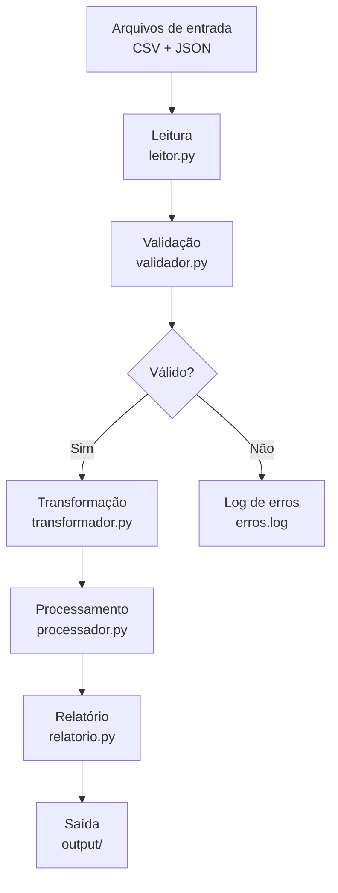

# Projeto — DataProcessor CLI

## Visão geral

O **DataProcessor CLI** é o projeto central do curso. Você vai construí-lo incrementalmente ao longo das aulas, adicionando peças a cada encontro.

Ao final da Fase 1, o sistema vai:

- Ler arquivos CSV e JSON da linha de comando
- Validar cada registro contra regras de negócio
- Normalizar e transformar os dados
- Cruzar informações entre clientes e transações
- Gerar um relatório consolidado em texto
- Salvar os resultados em arquivos de saída
- Registrar logs de execução

---

## Estrutura final do projeto

```
dataprocessor/
    main.py           ← ponto de entrada, orquestra o pipeline
    leitor.py         ← leitura de CSV e JSON (Aula 03)
    validador.py      ← validação dos dados (Aula 04)
    transformador.py  ← normalização e limpeza (Aula 05)
    processador.py    ← métricas e agregações (Aula 02)
    relatorio.py      ← geração de relatórios (fase posterior)
    logger.py         ← logs de execução (fase posterior)
    data/
        clientes.csv
        transacoes.csv
        config.json
    output/
        relatorio.txt
        clientes_validos.csv
        erros.log
```

---

## Pipeline de processamento



---

## O que está pronto ao fim de cada aula

| Aula | O que o DataProcessor consegue fazer                |
| ---- | --------------------------------------------------- |
| 01   | Ter dados hardcoded em memória e exibir por cidade  |
| 02   | Calcular métricas (média, mín, máx, total aprovado) |
| 03   | Ler dados reais de arquivos CSV e JSON              |
| 04   | Separar registros válidos de inválidos              |
| 05   | Normalizar dados e executar o pipeline completo     |

---

## Exemplo de saída esperada (Aula 05)

```
=== DataProcessor CLI ===

[LEITURA]
  clientes.csv ............. 5 registros
  transacoes.csv ........... 5 registros
  config.json .............. OK

[VALIDAÇÃO]
  Clientes válidos: 2 / 5
  Transações válidas: 2 / 5

[TRANSFORMAÇÃO]
  2 clientes normalizados
  2 transações normalizadas

[RELATÓRIO]
  Total aprovado: R$ 150.50
  Média de idade: 39.5
  Clientes por cidade:
    Joinville: 1
    Florianopolis: 1
```

---

## Como executar

```bash
cd dataprocessor
python main.py
```

Nas fases seguintes do curso, o projeto vai aceitar argumentos de linha de comando:

```bash
python main.py --clientes data/clientes.csv --config data/config.json --output output/
```
